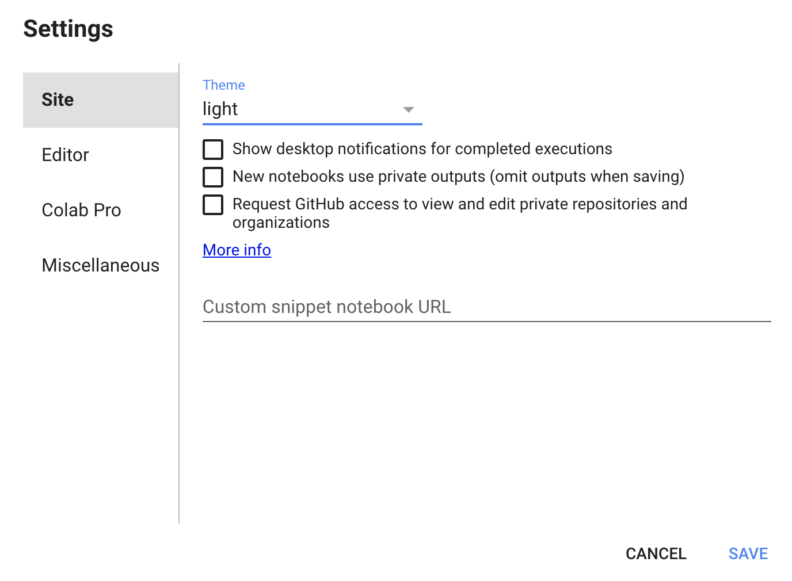
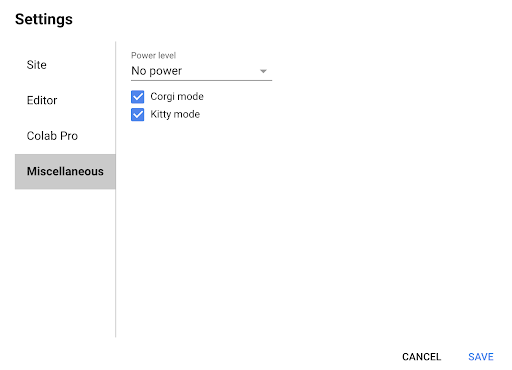

# Normative Modeling Practical CPC 2020
This repository contains written instructions, code, and data used for the (virtual) Normative Modeling Practical at the Computational Psychiatry Course on September 12th, 2020.

We will be running all of our code in Google Colab python notebooks. 
These are essentially Jupyter notebooks run in the cloud. 
Running our analysis using Colab will save us from dealing with python library installation and virtual environment setup. 
It also ensures that we are all working on the same operating system which makes troubleshooting much easier (since there are only 2 instructors and lots of students)! 

If you have never used Google Colab before, you can check out an into notebook with lots of helpful links here: 

We will also be using the Pandas library for a lot of our code. There is a great intro to Pandas Colab notebook here: 

Other helpful pandas links:
1. [Pandas cheatsheet](https://pandas.pydata.org/Pandas_Cheat_Sheet.pdf)
2. [Pandas Selecting/Indexing API](https://pandas.pydata.org/pandas-docs/stable/user_guide/indexing.html)

The template notebook we will be filling out during this practical can be launched here (you need to be signed in to a Google account in your internet browser, for best results, use Chrome): 

If you get stuck and need guidance, there is a filled out answer key notebook here: 

### Setup instructions for Google Colab
You can open the python notebook that we will use in this practical directly from this Github account. Before you open the notebook, make sure you are logged into a Google account. All of the code has been tested using Google Chrome web browser. When you are ready to begin, you will click on the (template) Google Colab button below. This will launch a new browser tab with the Google Colab notebook. 
Once you are in the Colab notebook, in the top right corner you will see a ‘Connect’ (or Reconnect) button. Click on this, and a dropdown menu will appear as shown below. Click on ‘Connect to hosted runtime’ this will allow you to run the notebook using Google’s cloud resources, which are likely much faster than your computer. If you would prefer to use your own computer’s resources, select ‘Connect to local runtime’. 
Note: sometimes if the notebook is left running for a long time without any activity (i.e. your computer goes to sleep), you will be disconnected from the runtime. In that case, you will need to click on this same button. It will appear as ‘Reconnect’ instead of ‘Connect’. You will also need to  re-run all code blocks. 

If you are using the Google cloud hosted option (no need to follow this step if using local runtime, unless you have your own GPU): 
Next, in the upper left corner, you will see a button called Runtime. Click on Runtime, and another dropdown panel will appear. As shown below. Click on ‘Change runtime type’.

This box will open, and you can select the ‘GPU’ option, then click save. 

In the same menu you used to change the runtime, there are several other optional things you can explore that may make your interacting with the notebook easier. Under ‘Tools’ there is a ‘Settings’ tab, which you can use to change the theme to light or dark mode using the ‘Site’ sub-tab. Then under the ‘Miscellaneous’ sub-tab, you can select Corgi or Kitty mode, and this will make cute animals walk across the top of your screen. There is no practical utility to this whatsoever, and it is for the sole purpose that cute animals spark joy. 

Also under the ‘Tools’ tab, there is an option to look at Keyboard shortcuts. You don’t need to change any of these, but you can review some of them if you want to learn about speeding up your coding practice. 

In the Colab python notebook, there are 2 types of cells: text cells & code cells. The text cells have plain text in them, that the notebook will not interpret as code. These are the cells that contain the background story & task instructions. The code cells have a play button on the left side. These are the cells that the notebook will run as code. To run a code cell, you can either click on the play button or use ‘Shift + Enter’. 
 
Now you are ready to begin coding! Good luck! 

Short (swc) pandas tutorials: https://swcarpentry.github.io/python-novice-gapminder/07-reading-tabular/index.html & https://swcarpentry.github.io/python-novice-gapminder/08-data-frames/index.html
Short (swc) plotting tutorial: https://swcarpentry.github.io/python-novice-gapminder/09-plotting/index.html
Long pandas tutorial: https://realpython.com/pandas-python-explore-dataset/

